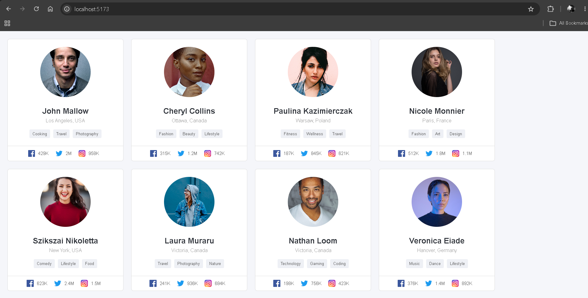

# 👤Profile Cards

A simple React project that dynamically generates user profile cards using an array of objects and reusable components.

## 🚀 Purpose

The goal of this project is to practice **React components, props, arrays, and `map()`** by creating multiple profile cards from user data.

## ✨ Features

- Multiple user profile cards
- Different details for each user
- Profile images
- Location information
- Interest tags
- Social media follower counts
- Responsive card layout

## 📚 Concepts Practiced

- React Components
- Props
- Arrays & Objects
- `map()`
- JSX
- Reusable Components
- Dynamic Data Rendering
- CSS Flexbox
- Flexbox `flex-wrap`

## 🎯 What I Learned

- How to create reusable React components
- How to pass data using props
- How to use `map()` to generate multiple components
- How to structure data using arrays of objects
- How a parent component passes data to a child component

## 📸 Screenshot

## 📌 Note

This project was built as part of my React learning journey to understand **reusable components, props, and dynamic rendering**.

## 👨‍💻 Author

**Ramit Sarker**
