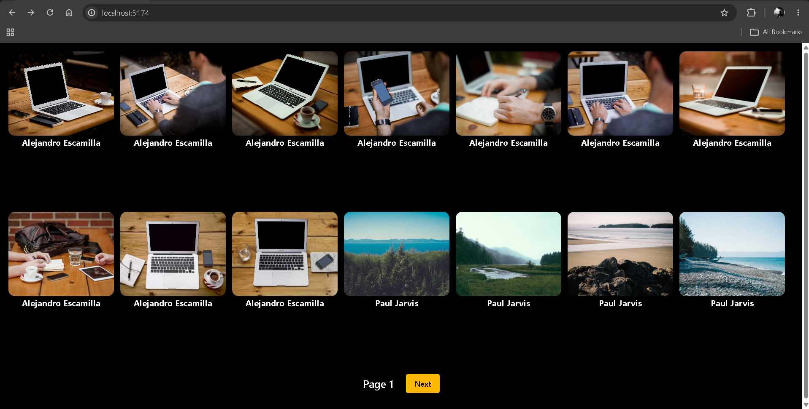
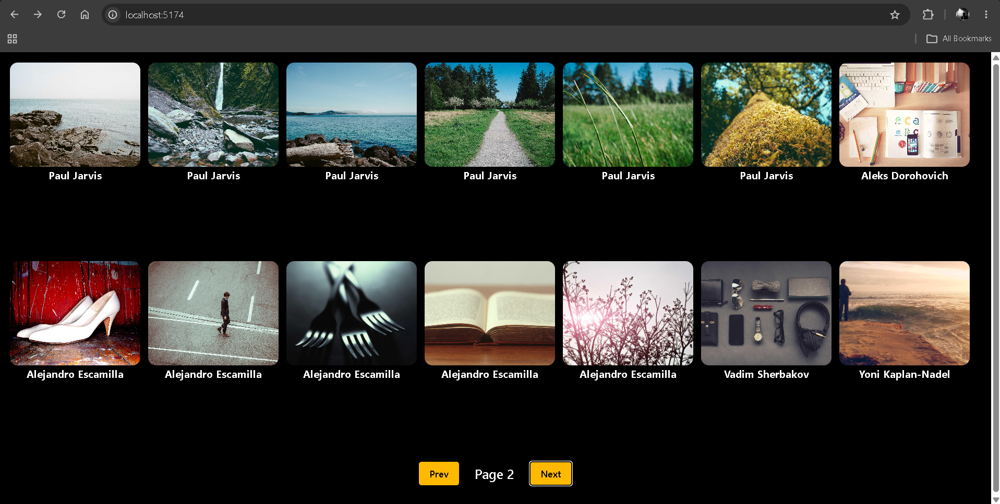

# 🖼️Image Gallery App

A React image gallery that fetches images from an API and displays them in a responsive grid with pagination.

## 🚀 Purpose

The goal of this project is to practice **API integration, React state management, `useEffect`, asynchronous functions, and pagination** by building a dynamic image gallery.

## 📸 Screenshots

### Page 1

### Page 2

## ✨ Features

- Fetches images from an external API
- Displays images dynamically
- Shows image author information
- Pagination with Next and Previous buttons
- Loading state while fetching data
- Previous button hidden on the first page
- Responsive grid layout
- Clickable images linking to their source

## 📚 Concepts Practiced

- React Components
- `useState`
- `useEffect`
- API Requests
- Axios
- Async/Await
- Promises
- `map()`
- Conditional Rendering
- Event Handling
- Pagination
- Tailwind CSS

## 🎯 What I Learned

- How to fetch API data using Axios
- How to use `useEffect` for API calls
- How state changes can trigger new API requests
- How to render API data dynamically using `map()`
- How to implement pagination using state
- How to conditionally render elements in React
- How to handle loading states
- How to build a responsive UI with Tailwind CSS

## 📌 Note

This project was built as part of my **React learning journey**, focusing on API integration, state management, pagination, and dynamic rendering.

## 👨‍💻 Author

**Ramit Sarker**
