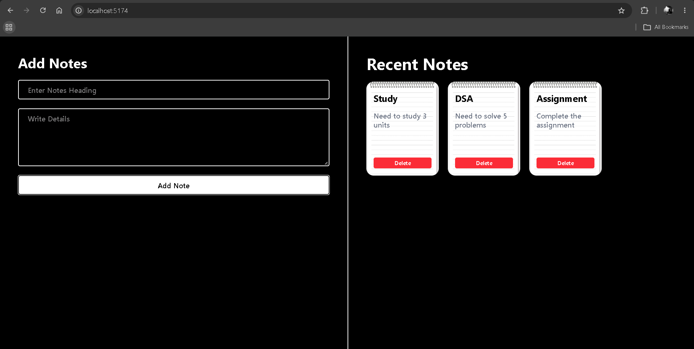

# 📝Notes App

A simple notes management application built with React that allows users to create, view, and delete notes through a clean and responsive interface.

## 🚀 Purpose

The goal of this project is to practice **React state management, forms, event handling, arrays, and dynamic rendering** by building a functional notes application.

## 📸 Screenshot

## ✨ Features

- Add new notes with a title and description
- Display notes dynamically
- Delete individual notes
- Controlled form inputs
- Responsive two-column layout
- Notebook-style note cards
- Interactive button effects

## 📚 Concepts Practiced

- React Components
- `useState`
- State Management
- Forms & Controlled Inputs
- Event Handling
- Arrays & Objects
- Spread Operator
- `map()`
- `splice()`
- Dynamic Rendering
- Tailwind CSS

## 🎯 What I Learned

- How to manage multiple pieces of state using `useState`
- How to create controlled inputs in React
- How to add and remove objects from an array in state
- How to render dynamic content using `map()`
- How to handle form submission with `preventDefault()`
- How to build a responsive UI using Tailwind CSS

## 📌 Note

This project was built as part of my **React learning journey**, focusing on state management, forms, dynamic rendering, and building functional UI through hands-on practice.

## 👨‍💻 Author

**Ramit Sarker**
