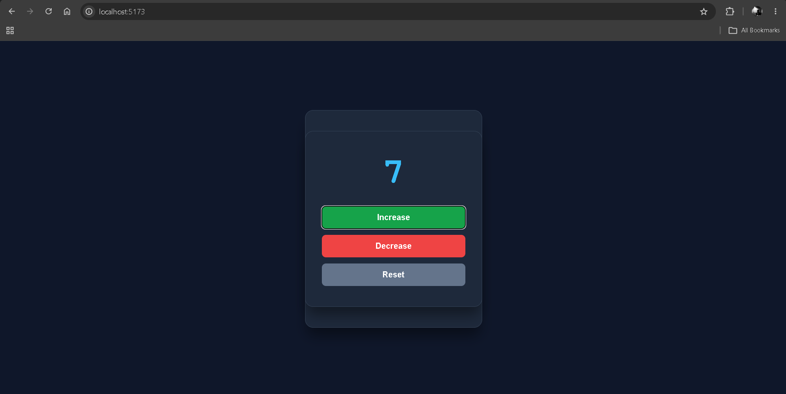
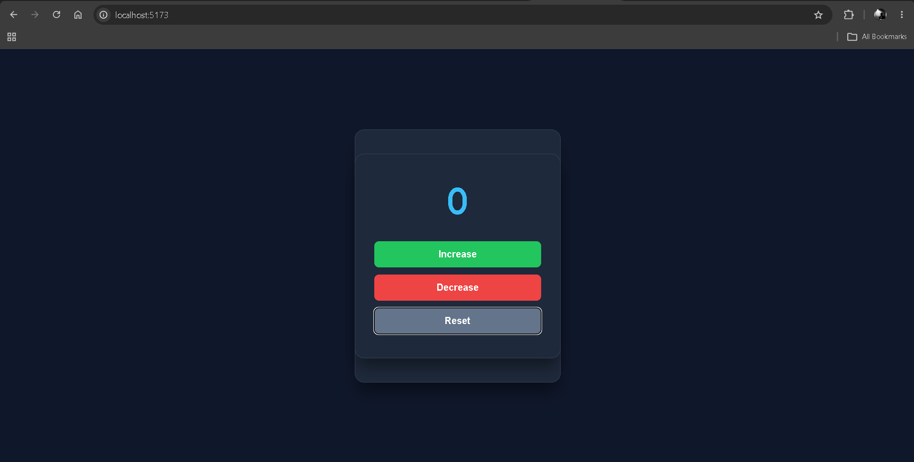

# 🔢Counter Project

A simple React counter application that allows users to increase, decrease, and reset a number using interactive buttons.

## 🚀 Purpose

The goal of this project is to practice **React state management and event handling** by building a simple interactive counter.

## ✨ Features

- Increase the counter value
- Decrease the counter value
- Reset the counter to `0`
- Interactive buttons with hover and click effects
- Clean and responsive card-based UI

## 📚 Concepts Practiced

- React Components
- `useState`
- State Management
- Event Handling
- `onClick`
- JSX
- CSS Styling
- Conditional State Updates

## 🎯 What I Learned

- How to manage state using React's `useState` hook
- How to update state based on user actions
- How to handle button click events
- How React re-renders the UI when state changes
- How to style a simple React application with CSS

## 📸 Screenshot

## 📌 Note

This project was built as part of my **React learning journey**, focusing on state management, event handling, and building interactive UI components.

## 👨‍💻 Author

**Ramit Sarker**
